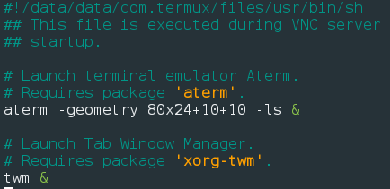
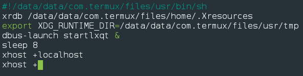
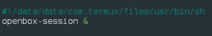
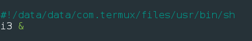
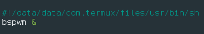
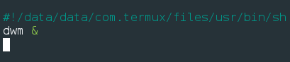
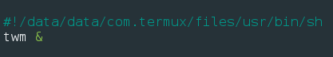

**Termux:x11/Wayland Branch**

This branch is for extensive documents for
- installing Wayland
- the Termux:x11 application
- starting Desktop Environments with Wayland
- Performance chart, including all Virtual Network Computing (or VNC) Viewers.

Check out [Termux:x11](https://github.com/termux/termux-x11)!

# General information
## x11 and Wayland
## Performance Chart
- Note: GLXGears is on fullscreen

|VNC Viewers|Display Protocol|glxGears Performance|HW Accel|Downsights|Remarks|
|-----------------|------|---|---|-----|-----|
|VNCViewer|xWinSys|27 frames in 5.2 seconds =  5.215 FPS|No|On rare cases, app just wont work because of `Permission Denied` errors|Recommended for those who are new to Termux and want to set up a desktop environment|
|bVNC|xWinSys|62 frames in 5.0 seconds = 12.295 FPS|Has problems with videos being played fullscreen|Interface too buggy|Probably another recommended one|
|xServer xSDL|xWinSys|89 frames in 5.0 seconds = 17.672 FPS|Yes (partially)|Display sometimes lags if you move the cursor around.|Almost as good as Termux:x11, recommended for an almost out-of-the-box VNC with HW Accel|
|Termux:x11|xWayland|198 frames in 5.0 seconds = 37.339 FPS|Yes (Has problems with oshu!)|Complex setup - sometimes doesn't work instantly|HW Accel go brr moment?|

- Where's kaLiKeX?

KaLiKeX isn't included here because it's based on bVNC.

# Troubleshooting
I decided to leave this here for my friends 😉
## Starting VNC/TigerVNC
### Native Termux:
Do `nano .vnc/xstartup`. If it's a fresh install, then you'll see this

Wanna start VNC with different environments and window managers? Then your `.vnc/xstartup` file should contain these

XFCE

LXQt

Openbox

i3WM

bspWM

dWM

xORG TWM
